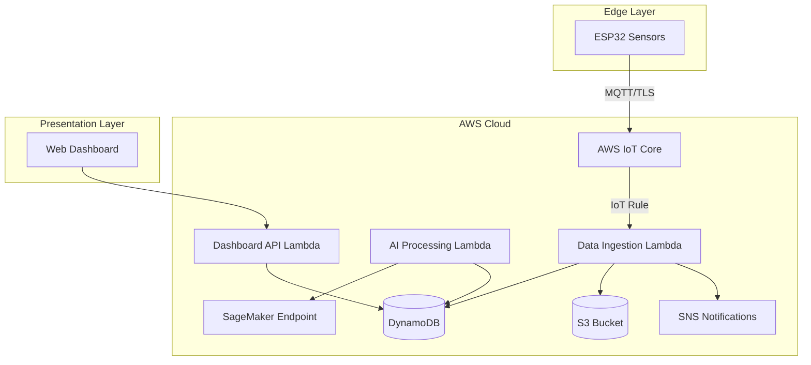

# Design Document: CarbonReady

## Overview

CarbonReady is a cloud-native carbon intelligence platform that enables smallholder cashew and coconut farmers in Goa to measure, understand, and improve their farm-level carbon position. The system combines low-cost ESP32 IoT sensors with AWS serverless infrastructure and AI-based biomass modeling to provide actionable sustainability insights.

The platform follows a three-tier architecture:
1. **Edge Layer**: ESP32 sensors collect environmental data (soil moisture, soil temperature, air temperature, humidity)
2. **Cloud Layer**: AWS serverless services (IoT Core, Lambda, DynamoDB, S3, SageMaker) process data and perform carbon calculations
3. **Presentation Layer**: Web dashboard displays carbon intelligence insights

Key design principles:
- Serverless-first architecture for scalability and cost optimization
- Security by design with certificate-based device authentication
- Modular AI pipeline for maintainability and versioning
- Data integrity verification at ingestion
- Audit traceability for 10+ years

## Architecture

### High-Level Architecture



### Data Flow

1. **Sensor Data Collection**: ESP32 sensors collect environmental readings every 15 minutes
2. **Secure Transmission**: Data transmitted via MQTT over TLS 1.2+ with X.509 certificates
3. **Data Ingestion**: IoT Core routes messages to Data Ingestion Lambda via IoT Rules
4. **Validation & Storage**: Lambda validates data, verifies cryptographic hash, stores in DynamoDB and S3
5. **AI Processing**: Scheduled Lambda triggers AI Processing Pipeline for carbon calculations
6. **Dashboard Access**: Users access insights via web dashboard backed by API Lambda

### Scalability Design

The architecture supports 1-100 farms in pilot phase with ability to scale further:
- **IoT Core**: Handles 100 messages/second (sufficient for 100 farms × 4 sensors × 15-min intervals)
- **DynamoDB**: On-demand capacity mode for pilot flexibility
- **Lambda**: Auto-scales based on invocation rate
- **S3**: Unlimited storage with lifecycle policies (archive to Glacier after 1 year)

## Components and Interfaces

### 1. ESP32 Sensor Module

**Responsibilities**:
- Collect environmental sensor readings
- Compute cryptographic hash of payload
- Transmit data securely to AWS IoT Core
- Store data locally if connectivity fails
- Retry transmission with exponential backoff

**Hardware Configuration**:
- Microcontroller: ESP32-WROOM-32
- Sensors: DHT22 (air temp/humidity), DS18B20 (soil temp), capacitive soil moisture sensor
- Cost target: ≤₹3,000 per farm

**Software Components**:
```
ESP32_Firmware
├── SensorManager
│   ├── readSoilMoisture()
│   ├── readSoilTemperature()
│   ├── readAirTemperature()
│   └── readHumidity()
├── DataProcessor
│   ├── createPayload()
│   ├── computeSHA256Hash()
│   └── compressData()
├── MQTTClient
│   ├── connect()
│   ├── publish()
│   └── handleRetry()
└── LocalStorage
    ├── storeOffline()
    └── syncWhenOnline()
```

**MQTT Topic Structure**:
- Publish: `carbonready/farm/{farmId}/sensor/data`
- Subscribe: `carbonready/farm/{farmId}/commands`

**Payload Format**:
```json
{
  "farmId": "string",
  "deviceId": "string",
  "timestamp": "ISO8601",
  "readings": {
    "soilMoisture": "float (0-100%)",
    "soilTemperature": "float (°C)",
    "airTemperature": "float (°C)",
    "humidity": "float (0-100%)"
  },
  "hash": "string (SHA-256)"
}
```

### 2. AWS IoT Core

**Responsibilities**:
- Authenticate devices using X.509 certificates
- Receive MQTT messages from ESP32 sensors
- Route messages to downstream services via IoT Rules

**Device Provisioning**:
- Each ESP32 receives unique X.509 certificate during installation
- Certificates stored in ESP32 SPIFFS partition (not embedded in firmware)
- Device ID derived from ESP32 MAC address
- Certificate lifecycle: 10-year validity, rotation supported

**IoT Rule Configuration**:
```sql
SELECT * FROM 'carbonready/farm/+/sensor/data'
WHERE hash IS NOT NULL
```
Action: Invoke Data Ingestion Lambda

**Security Policies**:
- Devices can only publish to their own farm topic
- Devices can only subscribe to their own command topic
- TLS 1.2+ required for all connections

### 3. Data Ingestion Lambda

**Responsibilities**:
- Validate sensor data format and ranges
- Verify cryptographic hash for data integrity
- Store validated data in DynamoDB and S3
- Handle anomalous data and tampering alerts
- Send notifications for critical errors

**Function Configuration**:
- Runtime: Python 3.12
- Memory: 512 MB
- Timeout: 30 seconds
- Concurrency: 100 (supports 100 farms)

**Processing Logic**:
```python
def lambda_handler(event, context):
    # 1. Parse incoming message
    payload = parse_mqtt_message(event)
    
    # 2. Verify cryptographic hash
    if not verify_hash(payload):
        log_tampering_alert(payload)
        send_sns_notification("Data tampering detected")
        return {"status": "rejected", "reason": "hash_mismatch"}
    
    # 3. Validate data ranges
    validation_result = validate_sensor_data(payload)
    if not validation_result.valid:
        log_anomaly(payload, validation_result.errors)
        return {"status": "rejected", "reason": "validation_failed"}
    
    # 4. Store in DynamoDB (hot storage)
    store_in_dynamodb(payload)
    
    # 5. Archive to S3 (cold storage)
    archive_to_s3(payload)
    
    return {"status": "success"}
```

**Validation Rules**:
- Soil moisture: 0-100%
- Soil temperature: -10°C to 60°C
- Air temperature: -10°C to 60°C
- Humidity: 0-100%
- Timestamp: within 5 minutes of current time

**DynamoDB Schema** (SensorData table):
```
Partition Key: farmId (String)
Sort Key: timestamp (Number, Unix epoch)
Attributes:
  - deviceId (String)
  - soilMoisture (Number)
  - soilTemperature (Number)
  - airTemperature (Number)
  - humidity (Number)
  - hash (String)
  - validationStatus (String)
TTL: 90 days (data archived to S3)
```

**S3 Storage Structure**:
```
s3://carbonready-sensor-data/
  ├── raw/
  │   └── year=2025/
  │       └── month=01/
  │           └── day=15/
  │               └── farm-{farmId}-{timestamp}.json.gz
  └── processed/
      └── year=2025/
          └── month=01/
              └── carbon-calculations-{farmId}-{date}.json
```

### 4. Farm Metadata Service

**Responsibilities**:
- Accept and validate farmer-provided farm metadata
- Store metadata with versioning support
- Provide metadata to AI Processing Pipeline

**API Endpoints** (via API Gateway + Lambda):
```
POST /api/v1/farms/{farmId}/metadata
GET /api/v1/farms/{farmId}/metadata
PUT /api/v1/farms/{farmId}/metadata
```

**Metadata Schema**:
```json
{
  "farmId": "string",
  "cropType": "enum (cashew, coconut)",
  "farmSizeHectares": "float (> 0)",
  "treeAge": "integer (1-100 years)",
  "treeHeight": "float (1-40 meters, coconut only)",
  "dbh": "float (1-200 cm, cashew only)",
  "plantationDensity": "integer (trees/hectare)",
  "fertilizerUsage": "float (kg/hectare/year)",
  "irrigationActivity": "float (liters/hectare/year)",
  "version": "integer",
  "updatedAt": "ISO8601"
}
```

**DynamoDB Schema** (FarmMetadata table):
```
Partition Key: farmId (String)
Sort Key: version (Number)
Attributes: (as above)
```

### 5. AI Processing Pipeline

**Responsibilities**:
- Calculate aboveground biomass using allometric equations
- Estimate annual sequestration increment
- Calculate carbon stock and CO₂ equivalent
- Analyze soil organic carbon trends
- Calculate emissions from fertilizer and irrigation
- Compute net carbon position
- Generate Carbon Readiness Index

**Trigger**: EventBridge scheduled rule (daily at 02:00 UTC)

**Function Configuration**:
- Runtime: Python 3.12
- Memory: 2048 MB
- Timeout: 5 minutes
- Concurrency: 10 (batch processing)

**Processing Workflow**:
```python
def process_farm_carbon(farm_id):
    # 1. Retrieve farm metadata
    metadata = get_farm_metadata(farm_id)
    
    # 2. Retrieve historical biomass data
    historical_biomass = get_historical_biomass(farm_id)
    
    # 3. Calculate aboveground biomass (in kg)
    # Option 1: Use SageMaker endpoint for ML-based estimation (future-ready)
    # biomass = invoke_sagemaker_endpoint(metadata, model_version)
    
    # Option 2: Use allometric equations (current implementation)
    biomass = calculate_biomass(metadata, model_version)
    
    # 4. Calculate annual sequestration increment (in kg biomass)
    if historical_biomass:
        biomass_increment = biomass - historical_biomass
    else:
        biomass_increment = estimate_sequestration_from_growth_curves(
            tree_age=metadata.treeAge,
            crop_type=metadata.cropType,
            region="Goa"
        )
    
    # 5. Calculate carbon stock and CO2 equivalent for total biomass
    carbon_stock = biomass * 0.5
    co2_equivalent_stock = carbon_stock * 3.667
    
    # 6. Convert annual sequestration to CO2e (CENTRAL CONVERSION)
    co2_equivalent_sequestration = convert_biomass_to_co2e(biomass_increment)
    
    # 7. Analyze SOC trend
    soc_trend = analyze_soc_trend(farm_id, metadata)
    
    # 8. Calculate emissions (already in CO2e)
    emissions = calculate_emissions(metadata)
    
    # 9. Compute net carbon position (both in CO2e kg/year)
    net_position = co2_equivalent_sequestration - emissions
    
    # 10. Generate Carbon Readiness Index
    cri = calculate_carbon_readiness_index(
        net_position=net_position,
        soc_trend=soc_trend,
        management_practices=metadata,
        weights=get_cri_weights()
    )
    
    # 11. Store results with model version
    store_carbon_calculation(farm_id, {
        "biomass": biomass,
        "carbonStock": carbon_stock,
        "co2EquivalentStock": co2_equivalent_stock,
        "annualSequestration": co2_equivalent_sequestration,
        "emissions": emissions,
        "netCarbonPosition": net_position,
        "socTrend": soc_trend,
        "carbonReadinessIndex": cri,
        "modelVersion": model_version,
        "calculatedAt": datetime.utcnow()
    })
```

#### 5.1 Biomass Calculation Module

**Allometric Equations**:

Based on research ([source](https://www.researchgate.net/publication/256295820_Allometric_equations_for_estimating_biomass_in_agricultural_landscapes_I_Aboveground_biomass)), allometric equations relate tree dimensions to biomass using the general form:

```
Biomass = a × DBH^b × Height^c
```

**Cashew-Specific Equation**:
```python
def calculate_cashew_biomass(dbh_cm, age_years):
    """
    Cashew allometric equation calibrated for Indian conditions
    Based on DBH and tree age
    """
    # Coefficients calibrated for Goa region
    a = 0.28
    b = 2.15
    age_factor = 1 + (0.02 * age_years)  # Age adjustment
    
    biomass_kg = a * (dbh_cm ** b) * age_factor
    return biomass_kg
```

**Coconut-Specific Equation**:
```python
def calculate_coconut_biomass(height_m, age_years):
    """
    Coconut allometric equation calibrated for Indian conditions
    Based on tree height and age
    """
    # Coefficients calibrated for Goa region
    a = 15.3
    b = 1.85
    age_factor = 1 + (0.015 * age_years)  # Age adjustment
    
    biomass_kg = a * (height_m ** b) * age_factor
    return biomass_kg
```

**Total Farm Biomass**:
```python
def calculate_farm_biomass(metadata):
    if metadata.cropType == "cashew":
        biomass_per_tree = calculate_cashew_biomass(
            metadata.dbh, 
            metadata.treeAge
        )
    else:  # coconut
        biomass_per_tree = calculate_coconut_biomass(
            metadata.treeHeight,
            metadata.treeAge
        )
    
    # Calculate total number of trees
    total_trees = metadata.plantationDensity * metadata.farmSizeHectares
    
    # Calculate total farm biomass
    total_biomass = biomass_per_tree * total_trees
    
    return total_biomass
```

#### 5.2 Annual Sequestration Module

**Important**: Annual_Sequestration_Increment is internally represented as biomass increment in kilograms. CO₂e conversion happens only once, centrally, following the conversion chain: biomass_increment → carbon_increment (×0.5) → CO₂e (×3.667).

**Growth Curve Estimation** (when historical data unavailable):
```python
def estimate_sequestration_from_growth_curves(tree_age, crop_type, region):
    """
    Estimate annual biomass sequestration using crop-specific growth curves
    calibrated to regional averages
    
    Returns biomass increment in kg (NOT CO2e)
    """
    # Load regional growth curve parameters
    growth_params = load_growth_curves(crop_type, region)
    
    # Calculate biomass at current age and previous year
    biomass_current = growth_params.calculate_biomass(tree_age)
    biomass_previous = growth_params.calculate_biomass(tree_age - 1)
    
    # Annual biomass increment in kg
    biomass_increment = biomass_current - biomass_previous
    
    return biomass_increment  # Returns kg biomass, NOT CO2e
```

**Central CO₂e Conversion** (applied once):
```python
def convert_biomass_to_co2e(biomass_kg):
    """
    Central conversion function: biomass → carbon → CO₂e
    This is the ONLY place where CO₂e conversion happens
    """
    # Step 1: Biomass to carbon (biomass × 0.5)
    carbon_kg = biomass_kg * 0.5
    
    # Step 2: Carbon to CO₂ equivalent (carbon × 3.667)
    co2_equivalent_kg = carbon_kg * 3.667
    
    return co2_equivalent_kg
```

**Growth Curve Parameters** (stored in DynamoDB):
```json
{
  "cropType": "cashew",
  "region": "Goa",
  "growthCurve": {
    "model": "Chapman-Richards",
    "parameters": {
      "a": 250.0,
      "b": 0.08,
      "c": 1.5
    }
  }
}
```

#### 5.3 Soil Organic Carbon Module

**SOC Trend Estimation**:
```python
def analyze_soc_trend(farm_id, metadata):
    """
    Estimate SOC trend using proxy modeling
    Requires minimum 90 days of data
    
    Returns a normalized SOC proxy score between -1 and +1
    """
    # Check data availability
    data_days = get_data_span_days(farm_id)
    if data_days < 90:
        return {"status": "Insufficient Data", "days": data_days}
    
    # 1. Calculate biomass return to soil
    biomass_return = estimate_biomass_return(
        crop_type=metadata.cropType,
        tree_age=metadata.treeAge,
        plantation_density=metadata.plantationDensity
    )
    
    # 2. Analyze management practices impact
    management_score = score_management_practices(
        fertilizer_usage=metadata.fertilizerUsage,
        irrigation_activity=metadata.irrigationActivity
    )
    
    # 3. Load regional baseline SOC
    regional_baseline = get_regional_soc_baseline(
        region="Goa",
        soil_type="laterite"  # Common in Goa
    )
    
    # 4. Retrieve environmental context
    env_data = get_environmental_data(farm_id, days=90)
    avg_soil_temp = calculate_average(env_data, "soilTemperature")
    avg_soil_moisture = calculate_average(env_data, "soilMoisture")
    
    # 5. Apply SOC proxy model
    # Returns normalized score between -1 and +1
    soc_trend_score = calculate_soc_proxy_model(
        biomass_return=biomass_return,
        management_score=management_score,
        baseline_soc=regional_baseline,
        soil_temp=avg_soil_temp,
        soil_moisture=avg_soil_moisture
    )
    
    # 6. Classify trend based on explicit thresholds
    # This is a normalized relative index
    if soc_trend_score > 0.05:
        classification = "Improving"
    elif soc_trend_score < -0.05:
        classification = "Declining"
    else:  # -0.05 to +0.05
        classification = "Stable"
    
    return {
        "status": classification,
        "score": soc_trend_score,  # Normalized between -1 and +1
        "biomassReturn": biomass_return,
        "managementScore": management_score,
        "dataSpanDays": data_days
    }
```

**SOC Proxy Score Interpretation**:
- The SOC proxy score is a normalized relative index ranging from -1 to +1
- Score > +0.05: Indicates improving soil organic carbon trend
- Score between -0.05 and +0.05: Indicates stable soil organic carbon
- Score < -0.05: Indicates declining soil organic carbon trend
- The score represents relative change compared to regional baseline, not absolute SOC values

**SOC Proxy Model Mathematical Description**:

The SOC proxy model estimates relative soil organic carbon trends using a weighted combination of observable factors:

```python
def calculate_soc_proxy_model(biomass_return, management_score, baseline_soc,
                               soil_temp, soil_moisture):
    """
    Calculate SOC proxy score using weighted multi-factor model
    
    Model equation:
    soc_proxy = (w1 × normalized_biomass_return) 
              + (w2 × management_score)
              - (w3 × temperature_factor)
              + (w4 × moisture_factor)
              - baseline_deviation
    
    Returns: normalized score between -1 and +1
    """
    # Model weights (calibrated for Goa region)
    WEIGHTS = {
        "biomass_return": 0.40,
        "management": 0.30,
        "temperature": 0.15,
        "moisture": 0.15
    }
    
    # 1. Normalize biomass return (0-1 scale)
    # Typical range: 0-20 kg/tree/year
    normalized_biomass_return = min(1.0, biomass_return / 20.0)
    
    # 2. Management score is already normalized (0-1 scale)
    # Moderate, optimal fertilizer and irrigation levels score higher
    # Over-fertilization can increase emissions and reduce SOC
    
    # 3. Temperature factor (higher temp = faster decomposition = negative)
    # Optimal soil temp: 20-25°C
    # Normalize deviation from optimal
    optimal_temp = 22.5
    temp_deviation = abs(soil_temp - optimal_temp) / 10.0
    temperature_factor = min(1.0, temp_deviation)
    
    # 4. Moisture factor (optimal moisture promotes SOC accumulation)
    # Optimal soil moisture: 40-60%
    if 40 <= soil_moisture <= 60:
        moisture_factor = 1.0
    else:
        moisture_factor = 1.0 - (abs(soil_moisture - 50) / 50.0)
    moisture_factor = max(0.0, moisture_factor)
    
    # 5. Calculate weighted proxy score
    raw_score = (
        WEIGHTS["biomass_return"] * normalized_biomass_return +
        WEIGHTS["management"] * management_score -
        WEIGHTS["temperature"] * temperature_factor +
        WEIGHTS["moisture"] * moisture_factor
    )
    
    # 6. Adjust for regional baseline deviation
    # If farm is below baseline, penalize; if above, reward
    baseline_deviation = 0.0  # Placeholder for future baseline comparison
    
    # 7. Normalize to -1 to +1 range
    # Raw score range is approximately -0.3 to +1.0
    # Midpoint empirically estimated as 0.35 based on weight distribution
    # and normalization assumptions
    # Map to -1 to +1
    normalized_score = (raw_score - 0.35) / 0.65
    normalized_score = max(-1.0, min(1.0, normalized_score))
    
    return normalized_score
```

**Model Rationale**:
- **Biomass Return** (40% weight): Higher organic matter input increases SOC
- **Management Practices** (30% weight): Sustainable practices (moderate fertilizer, irrigation) support SOC
- **Temperature Factor** (15% weight): Extreme temperatures accelerate decomposition, reducing SOC
- **Moisture Factor** (15% weight): Optimal moisture supports microbial activity and SOC formation

This is a simplified proxy model suitable for pilot phase. Future versions may incorporate direct soil sampling data.

**Biomass Return Estimation**:
```python
def estimate_biomass_return(crop_type, tree_age, plantation_density):
    """
    Estimate organic matter returned to soil from leaf litter,
    pruning, and crop residues
    """
    # Leaf litter rates (kg/tree/year)
    if crop_type == "cashew":
        litter_rate = 8.5 if tree_age > 10 else 4.2
    else:  # coconut
        litter_rate = 12.3 if tree_age > 15 else 6.5
    
    # Pruning residues (10% of litter)
    pruning_rate = litter_rate * 0.1
    
    # Total organic matter return per hectare
    total_return = (litter_rate + pruning_rate) * plantation_density
    
    return total_return
```

#### 5.4 Emissions Calculation Module

**IPCC Emission Factors**:

Based on IPCC Tier 1 guidelines, the direct emission factor for N2O from nitrogen fertilizer application is 1% (0.01 kg N2O-N per kg N applied).

```python
# IPCC Tier 1 Emission Factors
EMISSION_FACTORS = {
    "fertilizer_n2o": 0.01,  # IPCC Tier 1 Direct Emission Factor (1%)
    "n2o_to_co2e": 298,      # N2O global warming potential (GWP)
    "irrigation_energy": 0.5  # kg CO2 / 1000 liters (pump energy)
}
```

**Emissions Calculation**:
```python
def calculate_emissions(metadata):
    """
    Calculate total farm emissions from fertilizer and irrigation
    """
    # 1. Fertilizer emissions
    # Calculate total fertilizer for entire farm
    total_fertilizer_kg = metadata.fertilizerUsage * metadata.farmSizeHectares
    
    # Assume 46% N content in urea (common fertilizer)
    nitrogen_applied = total_fertilizer_kg * 0.46
    
    # N2O emissions using IPCC Tier 1 factor (1%)
    n2o_n_emissions = nitrogen_applied * EMISSION_FACTORS["fertilizer_n2o"]
    
    # Convert N2O-N to N2O (multiply by 44/28)
    n2o_emissions = n2o_n_emissions * (44/28)
    
    # Convert to CO2 equivalent
    fertilizer_co2e = n2o_emissions * EMISSION_FACTORS["n2o_to_co2e"]
    
    # 2. Irrigation emissions (from pump energy)
    # Calculate total irrigation for entire farm
    total_irrigation_liters = metadata.irrigationActivity * metadata.farmSizeHectares
    
    irrigation_co2e = (total_irrigation_liters / 1000) * \
                      EMISSION_FACTORS["irrigation_energy"]
    
    # 3. Total emissions
    total_emissions = fertilizer_co2e + irrigation_co2e
    
    return {
        "fertilizerEmissions": fertilizer_co2e,
        "irrigationEmissions": irrigation_co2e,
        "totalEmissions": total_emissions,
        "unit": "kg CO2e/year"
    }
```

#### 5.5 Carbon Readiness Index Module

**CRI Calculation**:
```python
def calculate_carbon_readiness_index(net_position, soc_trend, 
                                     management_practices, weights):
    """
    Calculate Carbon Readiness Index with configurable weights
    """
    # Validate weights sum to 100% (with floating point tolerance)
    if abs(sum(weights.values()) - 1.0) > 0.001:
        raise ValueError("Weights must sum to 1.0")
    
    # 1. Net Carbon Position score (0-100)
    # Normalize net position to 0-100 scale
    ncp_score = normalize_net_position(net_position, management_practices.farmSizeHectares)
    
    # 2. SOC Trend score (0-100)
    soc_score = {
        "Improving": 100,
        "Stable": 60,
        "Declining": 20,
        "Insufficient Data": 50
    }[soc_trend["status"]]
    
    # 3. Management Practices score (0-100)
    mgmt_score = score_management_practices(
        management_practices.fertilizerUsage,
        management_practices.irrigationActivity
    )
    
    # 4. Weighted sum
    cri = (
        ncp_score * weights["netCarbonPosition"] +
        soc_score * weights["socTrend"] +
        mgmt_score * weights["managementPractices"]
    )
    
    # 5. Classification
    if cri < 40:
        classification = "Needs Improvement"
    elif cri < 70:
        classification = "Moderate"
    else:
        classification = "Excellent"
    
    return {
        "score": round(cri, 2),
        "classification": classification,
        "components": {
            "netCarbonPosition": ncp_score,
            "socTrend": soc_score,
            "managementPractices": mgmt_score
        },
        "weights": weights
    }
```

**Net Carbon Position Normalization**:
```python
def normalize_net_position(net_position_co2e_kg_per_year, farm_size_hectares):
    """
    Normalize net carbon position to 0-100 scale on a per-hectare basis
    
    This makes the model scalable across different farm sizes by normalizing
    to per-hectare values before scoring.
    
    Normalization logic:
    - Calculate net position per hectare
    - Highly negative values (< -1000 kg CO2e/ha/year): score 0
    - Zero net position: score 50
    - Highly positive values (> +1000 kg CO2e/ha/year): score 100
    - Linear interpolation between these points
    
    This creates a sigmoid-like curve where:
    - Farms with net emissions get scores 0-50
    - Farms with net sequestration get scores 50-100
    """
    # Normalize to per-hectare basis
    net_position_per_hectare = net_position_co2e_kg_per_year / farm_size_hectares
    
    # Define normalization bounds (per hectare)
    MIN_NET_POSITION_PER_HA = -1000  # kg CO2e/ha/year (strong net source)
    MAX_NET_POSITION_PER_HA = 1000   # kg CO2e/ha/year (strong net sink)
    
    # Clamp to bounds
    clamped = max(MIN_NET_POSITION_PER_HA, 
                  min(MAX_NET_POSITION_PER_HA, net_position_per_hectare))
    
    # Linear normalization to 0-100
    normalized = ((clamped - MIN_NET_POSITION_PER_HA) / 
                  (MAX_NET_POSITION_PER_HA - MIN_NET_POSITION_PER_HA)) * 100
    
    return normalized
```

**Default Weights** (stored in DynamoDB, modifiable by admins):
```json
{
  "netCarbonPosition": 0.5,
  "socTrend": 0.3,
  "managementPractices": 0.2
}
```

### 6. Model Versioning Service

**Responsibilities**:
- Assign version identifiers to AI models
- Log model versions with calculations
- Support model rollback
- Maintain audit trail for 10+ years

**Model Registry** (DynamoDB table):
```
Table: AIModelRegistry
Partition Key: modelType (String: "biomass_cashew", "biomass_coconut", "soc_proxy", "emissions")
Sort Key: version (String: "v1.0.0")
Attributes:
  - deployedAt (ISO8601)
  - parameters (Map)
  - description (String)
  - status (String: "active", "deprecated", "archived")
  - retentionUntil (ISO8601, 10 years from deployment)
```

**Calculation Metadata** (stored with each carbon calculation):
```json
{
  "farmId": "string",
  "calculatedAt": "ISO8601",
  "modelVersions": {
    "biomass": "v1.2.0",
    "soc": "v1.0.1",
    "emissions": "v1.1.0",
    "cri": "v1.0.0"
  },
  "retentionUntil": "ISO8601 (10 years)"
}
```

### 7. Dashboard API

**Responsibilities**:
- Serve carbon intelligence data to web dashboard
- Provide CRI breakdown and transparency
- Handle user authentication and authorization
- Enforce admin-only access for CRI weight modification

**API Endpoints**:
```
GET /api/v1/farms/{farmId}/carbon-position
GET /api/v1/farms/{farmId}/carbon-readiness-index
GET /api/v1/farms/{farmId}/sensor-data/latest
GET /api/v1/farms/{farmId}/historical-trends?days=365
PUT /api/v1/admin/cri-weights (admin only)
GET /api/v1/admin/cri-weights
```

**CRI Breakdown Response**:
```json
{
  "farmId": "farm-001",
  "carbonReadinessIndex": {
    "score": 72.5,
    "classification": "Excellent",
    "components": {
      "netCarbonPosition": {
        "score": 85,
        "weight": 0.5,
        "contribution": 42.5
      },
      "socTrend": {
        "score": 60,
        "weight": 0.3,
        "contribution": 18.0
      },
      "managementPractices": {
        "score": 60,
        "weight": 0.2,
        "contribution": 12.0
      }
    },
    "scoringLogicVersion": "v1.0.0",
    "calculatedAt": "2025-01-15T10:30:00Z"
  }
}
```

**Authorization**:
- JWT-based authentication via Amazon Cognito
- Role-based access control (RBAC)
- Roles: "farmer", "admin"
- Admin role required for modifying CRI weights

### 8. Sensor Calibration Service

**Responsibilities**:
- Track sensor calibration events
- Flag sensors requiring recalibration
- Store calibration parameters

**Calibration Event Schema** (DynamoDB):
```
Table: SensorCalibration
Partition Key: deviceId (String)
Sort Key: calibrationDate (ISO8601)
Attributes:
  - farmId (String)
  - calibrationType (String: "initial", "annual", "maintenance")
  - calibrationParameters (Map)
  - referenceValues (Map)
  - performedBy (String)
  - nextCalibrationDue (ISO8601, +365 days)
```

**Calibration Check** (in Data Ingestion Lambda):
```python
def check_calibration_status(device_id):
    latest_calibration = get_latest_calibration(device_id)
    
    if not latest_calibration:
        return {"status": "uncalibrated", "action": "reject_data"}
    
    days_since_calibration = (datetime.utcnow() - 
                              latest_calibration.date).days
    
    if days_since_calibration > 365:
        flag_for_recalibration(device_id)
        send_notification(f"Device {device_id} requires recalibration")
        return {"status": "expired", "action": "flag_data"}
    
    return {"status": "valid", "action": "accept_data"}
```

## Data Models

### DynamoDB Tables

**1. SensorData**
```
Partition Key: farmId (String)
Sort Key: timestamp (Number)
Attributes:
  - deviceId (String)
  - soilMoisture (Number)
  - soilTemperature (Number)
  - airTemperature (Number)
  - humidity (Number)
  - hash (String)
  - validationStatus (String)
GSI: deviceId-timestamp-index
TTL: 90 days
```

**2. FarmMetadata**
```
Partition Key: farmId (String)
Sort Key: version (Number)
Attributes:
  - cropType (String)
  - farmSizeHectares (Number)
  - treeAge (Number)
  - treeHeight (Number, nullable)
  - dbh (Number, nullable)
  - plantationDensity (Number)
  - fertilizerUsage (Number)
  - irrigationActivity (Number)
  - updatedAt (String)
```

**3. CarbonCalculations**
```
Partition Key: farmId (String)
Sort Key: calculatedAt (String, ISO8601)
Attributes:
  - biomass (Number)
  - carbonStock (Number)
  - co2EquivalentStock (Number)
  - annualSequestration (Number)
  - emissions (Map)
  - netCarbonPosition (Number)
  - socTrend (Map)
  - carbonReadinessIndex (Map)
  - modelVersions (Map)
  - retentionUntil (String, ISO8601, +10 years)
```

**4. AIModelRegistry**
```
Partition Key: modelType (String)
Sort Key: version (String)
Attributes:
  - deployedAt (String)
  - parameters (Map)
  - description (String)
  - status (String)
  - retentionUntil (String, +10 years)
```

**5. SensorCalibration**
```
Partition Key: deviceId (String)
Sort Key: calibrationDate (String)
Attributes:
  - farmId (String)
  - calibrationType (String)
  - calibrationParameters (Map)
  - referenceValues (Map)
  - performedBy (String)
  - nextCalibrationDue (String)
```

**6. CRIWeights**
```
Partition Key: configId (String, always "default")
Sort Key: version (Number)
Attributes:
  - netCarbonPosition (Number)
  - socTrend (Number)
  - managementPractices (Number)
  - updatedAt (String)
  - updatedBy (String)
```

### S3 Data Structure

```
carbonready-sensor-data/
├── raw/
│   └── year=YYYY/
│       └── month=MM/
│           └── day=DD/
│               └── farm-{farmId}-{timestamp}.json.gz
├── processed/
│   └── year=YYYY/
│       └── month=MM/
│           └── carbon-calculations-{farmId}-{date}.json
└── models/
    └── {modelType}/
        └── {version}/
            ├── model.pkl
            ├── parameters.json
            └── metadata.json
```

## Correctness Properties

*A property is a characteristic or behavior that should hold true across all valid executions of a system—essentially, a formal statement about what the system should do. Properties serve as the bridge between human-readable specifications and machine-verifiable correctness guarantees.*


### Property 1: Sensor Collection Interval Compliance

*For any* deployed ESP32 sensor and any sensor type (soil moisture, soil temperature, air temperature, humidity), the time interval between consecutive readings SHALL NOT exceed 15 minutes.

**Validates: Requirements 1.1, 1.2, 1.3, 1.4**

### Property 2: UTC Timestamp Presence

*For any* sensor reading collected by the system, the reading SHALL include a timestamp in UTC format.

**Validates: Requirements 1.5, 5.4**

### Property 3: Farm Identifier Association

*For any* sensor reading collected by the system, the reading SHALL be associated with a valid farm identifier.

**Validates: Requirements 1.6**

### Property 4: Metadata Range Validation

*For any* farm metadata submission, the system SHALL accept the submission if and only if all values fall within their specified valid ranges (tree age: 1-100 years, DBH: 1-200 cm, tree height: 1-40 meters, plantation density > 0, fertilizer usage ≥ 0, irrigation activity ≥ 0).

**Validates: Requirements 2.1, 2.2, 2.3, 2.4, 2.5, 2.6, 2.7**

### Property 5: Validation Error Message Completeness

*For any* farm metadata submission that fails validation, the system SHALL return error messages that identify all invalid fields.

**Validates: Requirements 2.8**

### Property 6: Unauthenticated Device Rejection

*For any* ESP32 sensor connection attempt without valid X.509 certificate authentication, the system SHALL reject the connection and log the attempt.

**Validates: Requirements 3.1, 11.1, 11.2**

### Property 7: Malformed Data Rejection

*For any* sensor data message with incomplete or malformed format, the Data Ingestion Pipeline SHALL reject the data and log the error.

**Validates: Requirements 3.2, 3.3**

### Property 8: Valid Data Persistence

*For any* valid sensor data received by the system, the data SHALL be stored in both DynamoDB and archived to S3.

**Validates: Requirements 3.5**

### Property 9: Metadata Versioning

*For any* farm metadata update, the system SHALL create a new version record while preserving previous versions.

**Validates: Requirements 3.6**

### Property 10: Crop-Specific Biomass Calculation

*For any* biomass calculation, the system SHALL use coconut-specific allometric equations (based on tree height and age) for coconut farms and cashew-specific equations (based on DBH and age) for cashew farms.

**Validates: Requirements 4.1, 4.2**

### Property 11: Farm Biomass Scaling

*For any* biomass calculation, the total farm aboveground biomass SHALL equal the per-tree biomass multiplied by the plantation density and farm size in hectares.

**Validates: Requirements 4.3**

### Property 12: Numeric Precision Consistency

*For any* calculated numeric value (biomass, carbon stock, CO₂ equivalent, emissions), the stored value SHALL have exactly two decimal places of precision.

**Validates: Requirements 4.4, 5.3, 7.4**

### Property 13: Carbon Stock Calculation Accuracy

*For any* aboveground biomass value, the calculated carbon stock SHALL equal the biomass multiplied by 0.5.

**Validates: Requirements 5.1**

### Property 14: CO₂ Equivalent Conversion Accuracy

*For any* carbon stock value, the calculated CO₂ equivalent SHALL equal the carbon stock multiplied by 3.667.

**Validates: Requirements 5.2**

### Property 15: SOC Model Input Completeness

*For any* soil organic carbon trend estimation, the calculation SHALL incorporate biomass return data, management practices, regional baseline SOC values, and environmental context.

**Validates: Requirements 6.1**

### Property 16: SOC Data Sufficiency Requirement

*For any* farm, the system SHALL generate a soil organic carbon trend classification if and only if at least 90 days of environmental and management data are available; otherwise, it SHALL indicate "Insufficient Data" status.

**Validates: Requirements 6.5, 6.6**

### Property 17: SOC Classification Validity

*For any* soil organic carbon trend classification with sufficient data, the classification SHALL be one of "Improving", "Stable", or "Declining".

**Validates: Requirements 6.7**

### Property 18: IPCC Emission Factor Usage

*For any* emissions calculation, the system SHALL use IPCC emission factors for both fertilizer-related and irrigation-related emissions.

**Validates: Requirements 7.1, 7.2**

### Property 19: Emissions Unit Consistency

*For any* emissions calculation, the total emissions SHALL be expressed in CO₂ equivalent kilograms per year.

**Validates: Requirements 7.3**

### Property 20: Sequestration Calculation Method Selection

*For any* annual sequestration calculation, the system SHALL use historical biomass growth data when available, and SHALL use crop-specific growth curves calibrated to tree age and regional averages when historical data is unavailable.

**Validates: Requirements 8.1, 8.2**

### Property 21: Sequestration Unit Consistency

*For any* annual sequestration increment calculation, the result SHALL be expressed in CO₂ equivalent kilograms per year.

**Validates: Requirements 8.3**

### Property 22: Net Carbon Position Calculation Accuracy

*For any* farm with both annual sequestration increment and annual emissions data, the net carbon position SHALL equal the annual sequestration increment minus the annual emissions.

**Validates: Requirements 8.4**

### Property 23: Net Carbon Classification Logic

*For any* net carbon position calculation, the system SHALL classify the farm as "Net Carbon Sink" if the position is positive, and "Net Carbon Source" if the position is negative.

**Validates: Requirements 8.5, 8.6**

### Property 24: CRI Component Completeness

*For any* Carbon Readiness Index calculation, the system SHALL use all three components: Net Carbon Position, Soil Organic Carbon trend, and management practices data.

**Validates: Requirements 9.1**

### Property 25: CRI Weight Validation and Default Fallback

*For any* Carbon Readiness Index calculation, if custom weighting parameters are provided, the system SHALL validate that weights sum to 100%; if validation fails or no weights are provided, the system SHALL use default weights (50% Net Carbon Position, 30% SOC trend, 20% management practices).

**Validates: Requirements 9.2, 9.3, 9.4**

### Property 26: CRI Weight Modification Authorization

*For any* attempt to modify Carbon Readiness Index weighting parameters, the system SHALL verify administrative privileges and SHALL reject requests from non-admin users while logging the unauthorized attempt.

**Validates: Requirements 9.5, 9.6**

### Property 27: CRI Score Normalization

*For any* Carbon Readiness Index calculation, the final score SHALL be normalized to a value between 0 and 100 (inclusive).

**Validates: Requirements 9.7**

### Property 28: CRI Classification Thresholds

*For any* Carbon Readiness Index score, the system SHALL classify it as "Needs Improvement" if score < 40, "Moderate" if 40 ≤ score < 70, and "Excellent" if score ≥ 70.

**Validates: Requirements 9.8, 9.9, 9.10**

### Property 29: Dashboard API Data Completeness

*For any* dashboard API request for carbon intelligence data, the response SHALL include net carbon position, Carbon Readiness Index with classification, SOC trend, emissions breakdown, sequestration values, and latest sensor readings.

**Validates: Requirements 10.1, 10.2, 10.3, 10.4, 10.5, 10.6**

### Property 30: Lambda Error Logging

*For any* Lambda function failure, the system SHALL log the error to CloudWatch with full context including function name, error message, and stack trace.

**Validates: Requirements 14.1**

### Property 31: Sensor Transmission Retry Behavior

*For any* sensor data transmission failure, the ESP32 sensor SHALL retry transmission up to 3 times with exponential backoff.

**Validates: Requirements 14.2**

### Property 32: Offline Data Storage

*For any* sensor data that cannot be transmitted after all retry attempts, the ESP32 sensor SHALL store the data locally and transmit when connectivity is restored.

**Validates: Requirements 14.3**

### Property 33: Critical Error Notification

*For any* critical error (Lambda failure, data tampering, authentication failure), the system SHALL send a notification to system administrators via SNS.

**Validates: Requirements 14.4, 16.6**

### Property 34: API Error Message User-Friendliness

*For any* dashboard API error, the system SHALL return a user-friendly error message that does not expose internal system details.

**Validates: Requirements 14.5**

### Property 35: Sensor Data Range Validation

*For any* sensor reading, the system SHALL validate that soil moisture and humidity are between 0-100%, and that soil temperature and air temperature are between -10°C and 60°C; readings outside these ranges SHALL be flagged as anomalous and excluded from calculations.

**Validates: Requirements 15.1, 15.2, 15.3, 15.4**

### Property 36: Metadata Range Validation

*For any* farm metadata submission, the system SHALL validate that tree age is between 1-100 years, DBH is between 1-200 cm, and tree height is between 1-40 meters; submissions with out-of-range values SHALL be rejected.

**Validates: Requirements 15.5, 15.6, 15.7**

### Property 37: Cryptographic Hash Inclusion

*For any* sensor data payload prepared by an ESP32 sensor, the payload SHALL include a SHA-256 cryptographic hash of the data.

**Validates: Requirements 16.1, 16.2**

### Property 38: Data Integrity Verification

*For any* sensor data received by the Data Ingestion Pipeline, if the cryptographic hash verification fails, the system SHALL reject the data, log a tampering alert, and send an SNS notification; if verification succeeds, the system SHALL proceed with normal storage and processing.

**Validates: Requirements 16.5, 16.7**

### Property 39: CRI Transparency and Breakdown

*For any* Carbon Readiness Index displayed on the dashboard, the system SHALL provide a complete breakdown showing individual component contributions, weighting values used, and the version of scoring logic applied.

**Validates: Requirements 17.1, 17.2, 17.3, 17.4, 17.5, 17.6**

### Property 40: Uncalibrated Sensor Rejection

*For any* ESP32 sensor that has not been calibrated, the system SHALL reject data from that sensor until calibration confirmation is received.

**Validates: Requirements 18.1**

### Property 41: Calibration Event Logging

*For any* sensor calibration performed, the system SHALL log the event with timestamp, device ID, calibration parameters, and reference values.

**Validates: Requirements 18.2, 18.5**

### Property 42: Calibration Expiry Flagging

*For any* sensor that has not been calibrated for more than 365 days, the system SHALL flag the sensor as requiring recalibration and display a notification to the system administrator.

**Validates: Requirements 18.4, 18.6**

### Property 43: AI Model Version Assignment

*For any* AI model deployed for biomass or emissions calculation, the system SHALL assign a unique version identifier to the model.

**Validates: Requirements 19.1, 19.2**

### Property 44: Calculation Model Version Logging

*For any* carbon calculation performed, the system SHALL log and store the model version identifiers for all models used in the calculation.

**Validates: Requirements 19.3, 19.4**

### Property 45: Model Version Retention

*For any* new AI model version deployed, the system SHALL maintain all previous model versions to enable rollback capability.

**Validates: Requirements 19.5**

### Property 46: Model Rollback Capability

*For any* request to rollback to a previous AI model version, the system SHALL successfully switch to the specified previous version.

**Validates: Requirements 19.6**

### Property 47: Model Version Change Logging

*For any* AI model version change (deployment or rollback), the system SHALL log the change event with timestamp and reason.

**Validates: Requirements 19.7**

### Property 48: Audit Retention Period

*For any* carbon calculation metadata and associated model versions, the system SHALL retain the data for a minimum of 10 years with a retention timestamp set to 10 years from the calculation date.

**Validates: Requirements 19.8**

## Error Handling

### Error Categories

**1. Data Validation Errors**
- Invalid sensor readings (out of range)
- Malformed MQTT messages
- Invalid farm metadata
- Missing required fields

**Response**: Reject data, log error, return descriptive error message

**2. Authentication/Authorization Errors**
- Invalid or expired certificates
- Unauthorized API access
- Non-admin attempting privileged operations

**Response**: Reject request, log attempt, return 401/403 status

**3. Data Integrity Errors**
- Hash mismatch (tampering detected)
- Corrupted data payloads

**Response**: Reject data, log tampering alert, send SNS notification

**4. System Errors**
- Lambda function failures
- DynamoDB throttling
- S3 write failures
- SageMaker endpoint unavailable

**Response**: Log to CloudWatch, retry with exponential backoff, send SNS notification for critical failures

**5. Business Logic Errors**
- Insufficient data for SOC trend (< 90 days)
- Missing historical biomass data
- Invalid CRI weight configuration

**Response**: Use fallback logic, return appropriate status message, log warning

### Error Response Format

All API errors follow consistent format:
```json
{
  "error": {
    "code": "string (ERROR_CODE)",
    "message": "string (user-friendly message)",
    "details": {
      "field": "string (for validation errors)",
      "expected": "string",
      "received": "string"
    },
    "timestamp": "ISO8601",
    "requestId": "string"
  }
}
```

### Retry Strategies

**ESP32 Sensor Retries**:
- Initial retry: 2 seconds
- Second retry: 4 seconds
- Third retry: 8 seconds
- After 3 failures: store locally, retry on next collection cycle

**Lambda Retries** (via SQS Dead Letter Queue):
- Automatic retry: 3 attempts
- DLQ retention: 14 days
- Manual replay capability for DLQ messages

**DynamoDB Retries**:
- SDK automatic retry with exponential backoff
- Maximum 10 attempts
- Circuit breaker pattern for sustained failures

### Monitoring and Alerting

**CloudWatch Alarms**:
- Lambda error rate > 5%
- DynamoDB throttling events
- IoT Core connection failures > 10/minute
- S3 write failures
- Data tampering alerts

**SNS Topics**:
- `carbonready-critical-alerts`: Lambda failures, data tampering, authentication failures
- `carbonready-warnings`: Calibration expiry, data validation errors
- `carbonready-info`: Model version changes, configuration updates

## Testing Strategy

### Dual Testing Approach

The CarbonReady system requires both unit testing and property-based testing for comprehensive coverage:

**Unit Tests**: Validate specific examples, edge cases, and error conditions
- Specific biomass calculation examples with known inputs/outputs
- Edge cases (zero values, boundary conditions)
- Error handling paths
- Integration points between components

**Property-Based Tests**: Verify universal properties across all inputs
- Generate random farm metadata and verify calculation properties
- Test with wide range of sensor values
- Validate invariants hold across all scenarios
- Comprehensive input coverage through randomization

Both testing approaches are complementary and necessary. Unit tests catch concrete bugs in specific scenarios, while property tests verify general correctness across the input space.

### Property-Based Testing Configuration

**Library Selection**:
- Python: Hypothesis
- JavaScript/TypeScript: fast-check

**Test Configuration**:
- Minimum 100 iterations per property test (due to randomization)
- Each property test references its design document property
- Tag format: `# Feature: carbon-ready, Property {number}: {property_text}`

**Example Property Test Structure**:
```python
from hypothesis import given, strategies as st
import pytest

@given(
    tree_age=st.integers(min_value=1, max_value=100),
    dbh=st.floats(min_value=1.0, max_value=200.0),
    density=st.integers(min_value=1, max_value=1000),
    farm_size=st.floats(min_value=0.1, max_value=50.0)
)
@pytest.mark.property_test
def test_property_11_farm_biomass_scaling(tree_age, dbh, density, farm_size):
    """
    Feature: carbon-ready, Property 11: Farm Biomass Scaling
    For any biomass calculation, the total farm aboveground biomass 
    SHALL equal the per-tree biomass multiplied by the plantation density
    and farm size in hectares.
    """
    # Calculate per-tree biomass
    per_tree_biomass = calculate_cashew_biomass(dbh, tree_age)
    
    # Calculate total trees
    total_trees = density * farm_size
    
    # Calculate farm biomass
    farm_biomass = calculate_farm_biomass({
        "cropType": "cashew",
        "dbh": dbh,
        "treeAge": tree_age,
        "plantationDensity": density,
        "farmSizeHectares": farm_size
    })
    
    # Verify property
    expected_farm_biomass = per_tree_biomass * total_trees
    assert abs(farm_biomass - expected_farm_biomass) < 0.01
```

### Test Coverage Requirements

**Unit Test Coverage**:
- Lambda functions: > 80% code coverage
- Calculation modules: > 90% code coverage
- API endpoints: 100% endpoint coverage
- Error handling paths: 100% coverage

**Property Test Coverage**:
- All 48 correctness properties must have corresponding property tests
- Each property test must run minimum 100 iterations
- Property tests must cover all calculation modules

### Integration Testing

**IoT Integration Tests**:
- ESP32 → IoT Core → Lambda → DynamoDB flow
- Certificate authentication and rejection
- Data integrity verification end-to-end

**API Integration Tests**:
- Dashboard API → Lambda → DynamoDB queries
- Authorization and authentication flows
- Error response formats

**AI Pipeline Integration Tests**:
- Complete carbon calculation workflow
- Model versioning and rollback
- Data sufficiency checks

### Performance Testing

**Load Testing Scenarios**:
- 100 farms × 4 sensors × 4 readings/hour = 1,600 messages/hour
- Peak load: 100 messages/second burst
- Sustained load: 1 message/second average

**Performance Targets**:
- Data ingestion latency: < 5 seconds (p95)
- API response time: < 500ms (p95)
- Carbon calculation batch: < 5 minutes for 100 farms

### Security Testing

**Penetration Testing**:
- Certificate authentication bypass attempts
- Data tampering detection
- Authorization bypass attempts
- SQL injection (DynamoDB NoSQL injection)

**Compliance Testing**:
- Data retention policies (10-year audit trail)
- Access control enforcement
- Encryption in transit and at rest

## Deployment Architecture

### Infrastructure as Code

All infrastructure defined using AWS CDK (Python):
```
cdk/
├── stacks/
│   ├── iot_stack.py          # IoT Core, certificates, rules
│   ├── data_stack.py          # DynamoDB tables, S3 buckets
│   ├── compute_stack.py       # Lambda functions, layers
│   ├── api_stack.py           # API Gateway, Cognito
│   ├── ml_stack.py            # SageMaker endpoints
│   └── monitoring_stack.py    # CloudWatch, SNS
├── app.py
└── requirements.txt
```

### CI/CD Pipeline

**GitHub Actions Workflow**:
1. Code commit triggers pipeline
2. Run unit tests and property tests
3. Build Lambda deployment packages
4. Run CDK diff
5. Deploy to dev environment
6. Run integration tests
7. Manual approval for production
8. Deploy to production
9. Run smoke tests

### Environment Strategy

**Development**: Single AWS account, reduced capacity
**Staging**: Separate account, production-like configuration
**Production**: Separate account, full capacity, multi-AZ

### Monitoring and Observability

**CloudWatch Dashboards**:
- IoT message throughput
- Lambda invocation metrics
- DynamoDB read/write capacity
- API latency and error rates
- Carbon calculation success rate

**X-Ray Tracing**:
- End-to-end request tracing
- Performance bottleneck identification
- Error root cause analysis

**Custom Metrics**:
- Farms onboarded
- Carbon calculations per day
- Average Carbon Readiness Index
- Data quality score (% valid readings)

## Security Considerations

### Data Encryption

**In Transit**:
- TLS 1.2+ for all connections
- MQTT over TLS for sensor data
- HTTPS for API calls

**At Rest**:
- DynamoDB encryption enabled
- S3 server-side encryption (SSE-S3)
- Secrets Manager for sensitive configuration

### Access Control

**IAM Roles**:
- ESP32 devices: IoT policy (publish/subscribe only)
- Lambda functions: Least privilege (specific DynamoDB/S3 access)
- API users: Cognito user pools with RBAC

**Network Security**:
- VPC for Lambda functions (optional for enhanced security)
- Security groups restrict access
- No public database endpoints

### Audit Logging

**CloudTrail**:
- All API calls logged
- 10-year retention for compliance
- Tamper-proof audit trail

**Application Logs**:
- All authentication attempts
- All authorization failures
- All data validation errors
- All model version changes

## Scalability Considerations

### Current Capacity (Pilot: 1-100 farms)

- IoT Core: 100 messages/second
- DynamoDB: On-demand capacity
- Lambda: 100 concurrent executions
- S3: Unlimited storage

### Future Scaling (100-10,000 farms)

**Horizontal Scaling**:
- Lambda auto-scales automatically
- DynamoDB auto-scales with on-demand mode
- IoT Core scales automatically

**Optimization Strategies**:
- Batch processing for carbon calculations
- DynamoDB GSI for efficient queries
- S3 lifecycle policies for cost optimization
- CloudFront CDN for dashboard (if needed)

**Cost Projections**:
- 100 farms: ~$200/month
- 1,000 farms: ~$1,500/month
- 10,000 farms: ~$12,000/month

(Estimates based on AWS pricing calculator, subject to actual usage patterns. Assumes serverless inference or batch invocation model for SageMaker. If using real-time SageMaker endpoints running 24/7, costs would be significantly higher.)

## Future Enhancements

### Phase 2 Features (Post-Pilot)

1. **Mobile Application**: Native iOS/Android apps for farmers
2. **Predictive Analytics**: ML models for carbon sequestration forecasting
3. **Recommendations Engine**: AI-driven suggestions for improving Carbon Readiness Index
4. **Multi-Region Support**: Expand beyond Goa to other regions
5. **Advanced Sensors**: Soil pH, NPK sensors for enhanced SOC modeling
6. **Satellite Integration**: Remote sensing data for biomass validation

### Phase 3 Features (Future)

1. **Carbon Credit Trading**: Integration with carbon credit marketplaces
2. **Blockchain Verification**: Immutable carbon calculation records
3. **Community Features**: Farmer networks, best practice sharing
4. **Government Integration**: Reporting to agricultural departments
5. **Insurance Products**: Carbon-based crop insurance

## Conclusion

The CarbonReady design provides a scalable, secure, and maintainable platform for carbon intelligence in smallholder farms. The serverless architecture ensures cost-effectiveness during the pilot phase while supporting future growth. The modular AI pipeline enables continuous improvement of carbon models, and comprehensive testing strategies ensure correctness and reliability.

Key design strengths:
- Cloud-native serverless architecture for scalability
- Security by design with certificate-based authentication
- Comprehensive data integrity verification
- 10-year audit traceability for compliance
- Modular AI pipeline with versioning and rollback
- Property-based testing for correctness guarantees
- Cost-optimized for smallholder farmer affordability
